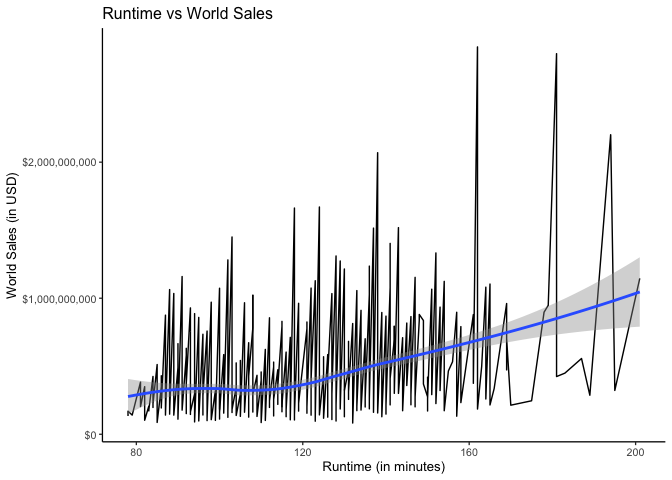

Top 1000 Hollywood Movies EDA
================
Georgianna James
2/18/2022

-   [Introduction](#introduction)
    -   [Required Packages](#required-packages)
    -   [Import the Data](#import-the-data)
-   [Tidying](#tidying)
-   [Top Movie Total Distribution Over
    Time](#top-movie-total-distribution-over-time)
-   [Average World Sales Over Time](#average-world-sales-over-time)
    -   [How do the world sales of top Hollywood movies vary over
        time?](#how-do-the-world-sales-of-top-hollywood-movies-vary-over-time)
    -   [How does the average yearly world sales of top Hollywood movies
        vary over
        time?](#how-does-the-average-yearly-world-sales-of-top-hollywood-movies-vary-over-time)
-   [License Trends](#license-trends)
    -   [How does average world sales vary by
        license?](#how-does-average-world-sales-vary-by-license)
        -   [G-Rated Films in the Top 1000 Hollywood Movies
            Dataset](#g-rated-films-in-the-top-1000-hollywood-movies-dataset)
    -   [What do the average sales look like per
        license?](#what-do-the-average-sales-look-like-per-license)
    -   [What is the distribution of films in each license
        category?](#what-is-the-distribution-of-films-in-each-license-category)
-   [Runtime Trends](#runtime-trends)
    -   [How does it relate to other
        variables?](#how-does-it-relate-to-other-variables)
-   [Distributor Trends](#distributor-trends)
    -   [Which distributor makes the most on
        average?](#which-distributor-makes-the-most-on-average)
        -   [Newmarket Films movies in the Top 1000 Hollywood Films
            Dataset](#newmarket-films-movies-in-the-top-1000-hollywood-films-dataset)
    -   [Which distributors most frequently make this top 1000 grossing
        movies
        list?](#which-distributors-most-frequently-make-this-top-1000-grossing-movies-list)
-   [Top Distributor Trends](#top-distributor-trends)
    -   [What license category do the top distributors specialize
        in?](#what-license-category-do-the-top-distributors-specialize-in)
    -   [Who is making the most money?](#who-is-making-the-most-money)
-   [Conclusion](#conclusion)
-   [NA Analysis](#na-analysis)

# Introduction

In this document, I will conduct an exploratory data analysis on the Top
1000 Hollywood Movies datset, which contains infomration about the top
1000 highest grossing films from 1972 to 2021. The dataset was last
updated in January of 2022. THe data was originally compiled by scaping
multiple sites, including rotten tomatoes and imbd. The original data
can be downloaded
[here](https://www.kaggle.com/sanjeetsinghnaik/top-1000-highest-grossing-movies?select=Highest+Holywood+Grossing+Movies.csv),
but is also included in this repo.

## Required Packages

``` r
library(tidyverse)
library(here)
library(lubridate)
library(knitr)
```

## Import the Data

Because the data is included in this R project, if you have downloaded
the project, you can import the data using the following commands.

``` r
movies <- read_csv(here("data", "Highest Holywood Grossing Movies.csv"))
```

# Tidying

The bulk of the legwork in analyzing this dataset is in the cleaning. In
order to clean this dataset, you must:

-   rename all of the titles
-   transform the date column into a usable date column using separate
    and lubridate
-   transform the runtime column into minutes

1)  First, I created a new data frame named “clean_movies” to clean,
    removed the index column, and renamed the columns to more user
    friendly titles.

``` r
clean_movies <- movies %>%
  select(-`...1`) %>% # remove index
  rename(title = `Title`, movie_info = `Movie Info`, distributor = `Distributor`, release_date = `Release Date`, domestic_sales_usd = `Domestic Sales (in $)`, international_sales_usd = `International Sales (in $)`, world_sales_usd = `World Sales (in $)`, genre = `Genre`, movie_runtime = `Movie Runtime`, license = `License`) #rename columns 
```

2)  Next, I transformed the release date column into a year, month, and
    day column, as well as a new release date column, using separate and
    lubridate.

``` r
clean_movies <- clean_movies %>%
  drop_na(release_date) %>%
  separate(release_date, into = c("release_day", "release_year"), sep = ",")  %>% #separate original date column
  separate(release_day, into = c("release_month", "release_day"), sep = " ") %>% 
  mutate(release_year = as.numeric(release_year), release_day = as.numeric(release_day), release_month = case_when(release_month == "January" ~ 1, release_month == "February" ~ 2, release_month == "March" ~ 3, release_month == "April" ~ 4, release_month == "May" ~ 5, release_month == "June" ~ 6, release_month == "July" ~ 7, release_month == "August" ~ 8, release_month == "September" ~ 8, release_month == "October" ~ 10, release_month == "November" ~ 11, release_month == "December" ~ 12)) %>% #mutating the columns to numeric type
  drop_na(release_year, release_month, release_day) %>%
  mutate(release_date = make_datetime(release_year, release_month, release_day)) #using lubridate to make a new release date column
```

3)  Finally, I transformed the runtime column into a numeric column that
    reported runtime in total minutes.

``` r
clean_movies <- clean_movies %>%
  separate(movie_runtime, into = c("hours", "na", "minutes", "na2"), sep = " ") %>% #separating original runtime column
  select(-na, -na2) %>% # removing "hrs" and "mins" columns this created
  mutate(hours = as.numeric(hours), minutes = as.numeric(minutes)) %>% #mutating columns to numeric type
  mutate(hours = hours * 60) %>% #transforming hours to minutes
  mutate(runtime = hours + minutes) %>% #combininng previous hours with minutes to get new runtime columnn
  select(-hours)
```

# Top Movie Total Distribution Over Time

<!-- -->

# Average World Sales Over Time

## How do the world sales of top Hollywood movies vary over time?

<!-- -->

## How does the average yearly world sales of top Hollywood movies vary over time?

<!-- -->

The graphs reveal that variation in world sales increased dramatically
overtime, as the volume of top movies being made increased
substantailly. However, when you take the average world sales per year,
you caputre less of this variation. In the average world sales figure
you observe a few peaks. The highest peak come early, around the mid
’70s, and then the trend slowly decreases into the late ’80s, and starts
to increase again until 2020, likely around when the COVID-19 pandemic
began.

# License Trends

## How does average world sales vary by license?

<!-- -->

This graph reveals that PG and PG-19 movies follow make a similar amount
of money, with R-rated films making slightly less. Additionally, there
are a few G-Rated films with sales that are significantly higher than
any other films. Let’s look a a table of all the G-rated movies to see
which ones these were.

### G-Rated Films in the Top 1000 Hollywood Movies Dataset

| Title                                       | Distributor                         | Release Year | World Sales ($) |
|:--------------------------------------------|:------------------------------------|-------------:|----------------:|
| Toy Story 4 (2019)                          | Walt Disney Studios Motion Pictures |         2019 |      1073394593 |
| The Lion King (1994)                        | Walt Disney Studios Motion Pictures |         1994 |      1063611805 |
| Ratatouille (2007)                          | Walt Disney Studios Motion Pictures |         2007 |       623726085 |
| Monsters, Inc. (2001)                       | Walt Disney Studios Motion Pictures |         2001 |       579707738 |
| Cars 2 (2011)                               | Walt Disney Studios Motion Pictures |         2011 |       559852396 |
| Rio 2 (2014)                                | Twentieth Century Fox               |         2014 |       498781117 |
| Tarzan (1999)                               | Walt Disney Studios Motion Pictures |         1999 |       448191819 |
| Alvin and the Chipmunks: Chipwrecked (2011) | Twentieth Century Fox               |         2011 |       342695435 |
| Chicken Little (2005)                       | Walt Disney Studios Motion Pictures |         2005 |       314432837 |
| High School Musical 3: Senior Year (2008)   | Walt Disney Studios Motion Pictures |         2008 |       252909177 |
| The Peanuts Movie (2015)                    | Twentieth Century Fox               |         2015 |       246233113 |
| The Princess Diaries (2001)                 | Walt Disney Studios Motion Pictures |         2001 |       165335153 |
| Charlotte’s Web (2006)                      | Paramount Pictures                  |         2006 |       148963822 |
| Star Trek: The Motion Picture (1979)        | Paramount Pictures                  |         1979 |        82604699 |

The two major outliers, which made over a billion dollars in world
sales, were Toy Story 4 (2019) and The Lion King (1994), which of course
makes sense, considering these are some pretty classic films.

## What do the average sales look like per license?

<!-- -->

G-Rated movies, as we saw before, average really high sales, but not too
much more than PG-13 or PG movies. R-rated movies trail behind pretty
significantly. Are distributors focusing on G-rated movies due to the
potential profitability?

## What is the distribution of films in each license category?

<!-- -->

G rated movies very infrequently appear on the top 1000s Hollywood
movies list, however, when they do, they are really profitable! It seems
as though, if a G-rated movie is going to be a hit, it’s going to be a
big hit.

PG-13 movies, on the other hand, are the most frequent type of film to
make it on the top 1000 Hollywood movies list, and this license category
has average world sales that rival that of the G-rated films.

# Runtime Trends

## How does it relate to other variables?

<!-- -->

There isn’t to strong of a relationship between runtime and world sales,
though you might be able to tease our a slightly positive relationship.

<!-- -->

Rated G movies average to be the shortest, while R and PG-13 are the
longest!

<!-- -->

Variation in runtime increased overtime as more top movies were made per
year.

# Distributor Trends

## Which distributor makes the most on average?

<!-- -->

Most of the top distributors are household names, but there is one that
is less familiar: Newmarket Films, which makes the top of the list in
terms of average world sales. Let’s look at what top films Newmarket
Films has made.

### Newmarket Films movies in the Top 1000 Hollywood Films Dataset

| Title                            | Release Year | Distributor     | World Sales ($) |
|:---------------------------------|-------------:|:----------------|----------------:|
| The Passion of the Christ (2004) |         2004 | Newmarket Films |       612054506 |

Apparently, Newmarket Films made a film titled The Passion of Christ
(2004) that did incredibly well, with world sales of over six billion
dollars. However, this is the onnly one of their films that made the top
1000 Hollywood movies dataset, so their average is super high.

## Which distributors most frequently make this top 1000 grossing movies list?

<!-- -->

This is likely what most people would expect, with the classis
distributors making significantly more top grossing films than any other
companies.

# Top Distributor Trends

## What license category do the top distributors specialize in?

<!-- -->

The most noticable trends are that Disney is the most successful at
making G-Rated movies, as they are the only ones with any G-rated movies
in the top 1000 grossing movies list. Additionally, Universal seems to
have made ignificantly more PG-13 movies that anyone else.

## Who is making the most money?

<!-- -->

Walt Disney Studios has made significantly more than the other top
distributors from 1983 - 2021. Universal comes in at second with a
little more than half of what Disney has made.

# Conclusion

R-rated movies seem to be the least successful of the license
categories. I predict that this is because of the age restrictions
regarding who can see R-rated movies, however that goes beyond the scope
of this analysis. G-rated movies are the least frequent rating of movie
to make this list. However, when they do, they are shorter on average
and make more money on average than the other categories.

In regards to distributors, Walt Disney Studios appears to be the most
successful at making G-rated movies, and also at making money. I
hypothesize that the two are related, considering how much money the hit
G-rated movies make. Warner Bros., who had the most movies on this list
but made no G-rated movies and very few PG-13, made significantly less
than Disney, which goes to show how much more profitable more accessible
movies are.

# NA Analysis

In this dataset, there are a lot of uneccessary missing values that
could be filled in with a quick google search. Here is a list of those
films that contained important missing values. As you can see, including
this information may significantly change the analysis.

| Title                                               |
|:----------------------------------------------------|
| Black Panther (2018)                                |
| Avengers: Infinity War (2018)                       |
| Spider-Man: No Way Home (2021)                      |
| Incredibles 2 (2018)                                |
| Finding Dory (2016)                                 |
| Harry Potter and the Deathly Hallows: Part 2 (2011) |
| Zootopia (2016)                                     |
| Aquaman (2018)                                      |
| The Hobbit: An Unexpected Journey (2012)            |
| Harry Potter and the Deathly Hallows: Part 1 (2010) |
| Monsters University (2013)                          |
| The Hobbit: The Desolation of Smaug (2013)          |
| The Hobbit: The Battle of the Five Armies (2014)    |
| Night at the Museum (2006)                          |
| Moana (2016)                                        |
| The Exorcist (1973)                                 |
| Justice League (2017)                               |
| Shang-Chi and the Legend of the Ten Rings (2021)    |
| National Treasure: Book of Secrets (2007)           |
| Ant-Man and the Wasp (2018)                         |
| Venom: Let There Be Carnage (2021)                  |
| Coco (2017)                                         |
| The Amazing Spider-Man 2 (2014)                     |
| Madagascar (2005)                                   |
| Sherlock Holmes: A Game of Shadows (2011)           |
| Snow White and the Seven Dwarfs (1937)              |
| The Fugitive (1993)                                 |
| Black Widow (2021)                                  |
| Liar Liar (1997)                                    |
| The Boss Baby (2017)                                |
| Apollo 13 (1995)                                    |
| Home Alone 2: Lost in New York (1992)               |
| F9: The Fast Saga (2021)                            |
| Wild Hogs (2007)                                    |
| Eternals (2021)                                     |
| No Time to Die (2021)                               |
| A Quiet Place Part II (2020)                        |
| The Firm (1993)                                     |
| Over the Hedge (2006)                               |
| Cars 3 (2017)                                       |
| Daddy’s Home (2015)                                 |
| Lethal Weapon 2 (1989)                              |
| Doctor Dolittle (1998)                              |
| Marley & Me (2008)                                  |
| Pocahontas (1995)                                   |
| Deep Impact (1998)                                  |
| Sister Act (1992)                                   |
| Good Will Hunting (1997)                            |
| Ransom (1996)                                       |
| Wonder (2017)                                       |
| Rocky IV (1985)                                     |
| The Truman Show (1998)                              |
| Tomorrow Never Dies (1997)                          |
| Ghostbusters: Afterlife (2021)                      |
| Traffic (2000)                                      |
| The Birdcage (1996)                                 |
| The Good Dinosaur (2015)                            |
| The Bodyguard (1992)                                |
| Free Guy (2021)                                     |
| Hairspray (2007)                                    |
| Ocean’s Thirteen (2007)                             |
| Jungle Cruise (2021)                                |
| Sing 2 (2021)                                       |
| Star Trek IV: The Voyage Home (1986)                |
| A Time to Kill (1996)                               |
| Ace Ventura: When Nature Calls (1995)               |
| Dune (2021)                                         |
| Indecent Proposal (1993)                            |
| GoldenEye (1995)                                    |
| How to Lose a Guy in 10 Days (2003)                 |
| The First Wives Club (1996)                         |
| Phenomenon (1996)                                   |
| Dreamgirls (2006)                                   |
| Maverick (1994)                                     |
| Unforgiven (1992)                                   |
| The Pelican Brief (1993)                            |
| Godzilla vs. Kong (2021)                            |
| A Wrinkle in Time (2018)                            |
| Casper (1995)                                       |
| Meet the Robinsons (2007)                           |
| Michael (1996)                                      |
| Beverly Hills Chihuahua (2008)                      |
| Saturday Night Fever (1977)                         |
| He’s Just Not That Into You (2009)                  |
| Lady and the Tramp (1955)                           |
| Flubber (1997)                                      |
| Encanto (2021)                                      |
| The Client (1994)                                   |
| John Wick: Chapter 2 (2017)                         |
| Star Trek: First Contact (1996)                     |
| Crimson Tide (1995)                                 |
| The Imitation Game (2014)                           |
| Save the Last Dance (2001)                          |
| The Game Plan (2007)                                |
| Madea Goes to Jail (2009)                           |
| Space Jam (1996)                                    |
| Flightplan (2005)                                   |
| The Hand that Rocks the Cradle (1992)               |
| Peter Pan (1953)                                    |
| The Campaign (2012)                                 |
| Cruella (2021)                                      |
| Alvin and the Chipmunks: The Road Chip (2015)       |
| Real Steel (2011)                                   |
| Stripes (1981)                                      |
| Aliens (1986)                                       |
| Dangerous Minds (1995)                              |
| The Santa Clause 3: The Escape Clause (2006)        |
| Scooby-Doo 2: Monsters Unleashed (2004)             |
| The X Files (1998)                                  |
| Under Siege (1992)                                  |
| Apocalypse Now (1979)                               |
| Smallfoot (2018)                                    |
| The Descendants (2011)                              |
| Cheaper by the Dozen 2 (2005)                       |
| Mr. Holland’s Opus (1995)                           |
| Bridge to Terabithia (2007)                         |
| MASH (1970)                                         |
| Congo (1995)                                        |
